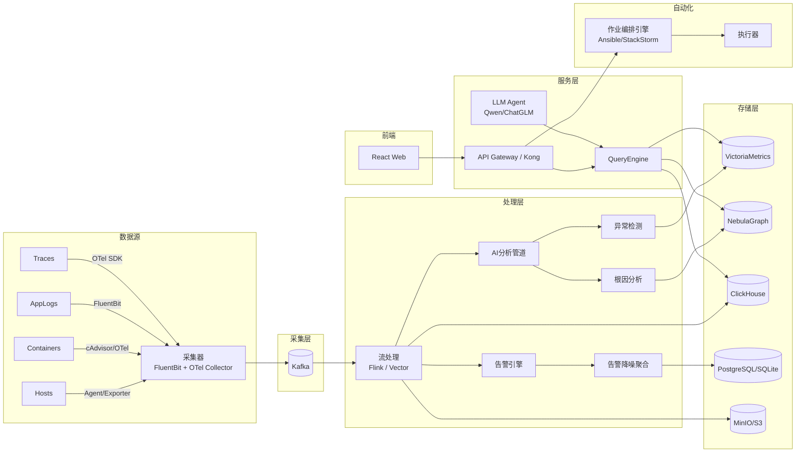

#核心功能模块 

## 一、全栈可观测性基线（基础必备）

### 功能 1：统一指标采集与监控

- **功能描述**：无需多套系统，统一采集主机、容器、K8s、中间件、数据库、云资源的性能指标（CPU、内存、磁盘、网络、连接数、QPS、延迟等），支持自定义业务指标。提供实时仪表盘和历史趋势分析。
- **实现途径**：
  - 开源Agent：基于 **Telegraf / Prometheus Node Exporter** 二次开发，支持 x86、ARM、国产CPU（鲲鹏、飞腾）。
  - 集成 **Prometheus** 作为指标存储，使用 **VictoriaMetrics** 做长期存储（兼容 PromQL，资源占用更低）。
  - 通过 **Grafana** 或自研轻量可视化前端展示。

### 功能 2：分布式链路追踪（APM）

- **功能描述**：自动埋点 Java、Go、Python、Node.js 应用，采集调用链（Trace），展示服务依赖拓扑、慢调用分析、错误链定位，支持按 TraceID 检索全链路日志。
- **实现途径**：
  - 基于 **OpenTelemetry SDK** 实现无侵入埋点（Java Agent 修改字节码）。
  - 后端使用 **Jaeger** 或 **SigNoz**（开源APM），扩展其存储为 ClickHouse 以提高查询性能。
  - 自研服务拓扑生成器：根据 Trace 数据动态绘制服务调用图。

### 功能 3：日志集中管理与关联分析

- **功能描述**：采集应用日志、系统日志、容器日志，支持全文检索、字段提取、实时语法高亮；自动将日志与指标、链路关联（如通过 TraceID 或请求ID 跳转）。
- **实现途径**：
  - 采集端：**Fluent Bit** + 自研路由插件，支持压缩加密传输。
  - 存储与索引：**ClickHouse**（存原始日志） + **Bleve**（轻量倒排索引，节省内存），替代 Elasticsearch 以降低资源消耗。
  - 关联引擎：日志解析时提取 TraceID / SpanID，建立跳转索引。

---

## 二、AIOps 智能分析引擎（核心差异化）

### 功能 4：自适应异常检测（无需人工设阈值）

- **功能描述**：对每个监控指标自动学习周期性基线和趋势，实时检测异常突增/突降、波动率变化，支持多指标联合异常检测（如 CPU+内存同时上涨）。告警灵敏度可分级（低/中/高）。
- **实现途径**：
  - 时序异常检测算法：集成 **Prophet**（季节性和趋势分解）+ **STL** + **3-sigma 动态修正**。
  - 多指标联合检测：采用 **孤立森林（Isolation Forest）** 或 **DBSCAN** 聚类，识别维度组合异常。
  - 模型轻量化：使用 **River**（在线学习库）实现模型增量更新，避免全量重训。

### 功能 5：智能根因分析

- **功能描述**：当发生异常时，自动关联相关指标、日志、变更事件（如发布、配置变更），给出根因候选（如“数据库连接池泄漏”、“慢SQL增多”），并标注置信度。
- **实现途径**：
  - 构建动态知识图谱：将服务、主机、实例、中间件等实体及其调用关系存入图数据库（**NebulaGraph** 或 **Dgraph**）。
  - 根因推理算法：采用 **随机游走** 或 **PC 算法（因果发现）** 以及 **贝叶斯网络** 计算异常传播路径。
  - 集成变更记录：对接 CI/CD 系统（Jenkins、GitLab）获取发布历史，作为根因输入之一。

### 功能 6：告警降噪与事件聚合

- **功能描述**：将数十条相似告警合并为 1 条“事件”，抑制瞬时抖动告警，按服务影响程度分级推送给值班人员，避免告警风暴。
- **实现途径**：
  - 告警压缩：基于 **时间窗口 + 模式相似度（LCSS 算法）** 对告警文本/标签聚类。
  - 动态抑制：定义“静默期”和“依赖告警抑制规则”（如主机宕机时自动屏蔽该主机的所有子服务告警）。
  - 事件评分：根据服务拓扑位置和业务标签（核心/非核心）计算危急值，优先推送影响范围大的事件。

---

## 三、自动化与交互创新

### 功能 7：运维自然语言助手（NL2Ops + LLM）

- **功能描述**：用户可用中文自然语言提问（如“过去1小时哪个服务最慢？”“帮我查一下订单服务的错误日志”），系统返回图表或数据；支持生成故障排查脚本并一键执行。
- **实现途径**：
  - 本地化部署的轻量 LLM（如 **Qwen2-7B-Instruct** 或 **ChatGLM3-6B** 量化为 INT8）跑在 GPU 或国产 AI 卡（昇腾、寒武纪）。
  - 构建运维专属 Agent：将 PromQL 查询、日志检索、Trace 查询封装为 tools，通过 ReAct 模式让 LLM 调用。
  - 提示词工程 + 少量运维场景微调，提升指令准确率。

### 功能 8：自动化运维作业

- **功能描述**：支持低代码编排故障自愈流程（如“磁盘清理”、“重启进程”、“切流”），可通过界面拖拽生成作业，也可由 AI 助手推荐执行步骤。
- **实现途径**：
  - 作业引擎基于 **Ansible** 或 **SaltStack** 的 API 封装，支持 SSH/WinRM 执行。
  - 流程编排：开源组件 **StackStorm**（事件驱动自动化）或自研轻量工作流引擎（BPMN 简化版）。
  - 安全管控：所有脚本需审批后执行，支持回滚配置快照。

### 功能 9：拓扑自动发现与服务地图

- **功能描述**：自动扫描网络、K8s 集群、注册中心（Nacos/ZK），构建实时更新的服务依赖地图，支持下钻查看每个节点的指标、日志和告警。
- **实现途径**：
  - 数据源：对接 CMDB 或直接从 K8s API / Eureka / Nacos 拉取服务注册信息。
  - 后端存储：图数据库 **NebulaGraph** 存储关系。
  - 前端渲染：**AntV G6** 或 **ECharts Graph**，支持交互式布局。

---

## 四、平台管理与信创适配

### 功能 10：私有化部署及信创适配

- **功能描述**：一键安装包（Docker Compose / Helm），支持离线环境；适配国产操作系统（麒麟、UOS）、国产数据库（达梦、人大金仓）、国产 CPU（鲲鹏、飞腾、龙芯）。
- **实现途径**：
  - 发行版：所有组件容器化，提供离线镜像包。
  - 替换存储：默认使用 **SQLite** 做元数据（小规模），支持切换至 **达梦**、**金仓**（通过 GORM 数据库抽象层适配）。
  - 前端适配国产浏览器：兼容 Chromium 内核（360、奇安信）。

### 功能 11：多租户与权限体系

- **功能描述**：支持团队/项目隔离，RBAC 细粒度控制（资源查看、告警配置、作业执行），审计日志记录所有操作。
- **实现途径**：
  - 接入 **Casbin** 做权限策略管理。
  - 认证支持 OIDC/LDAP/企业微信/OAuth2 对接。

---

## 五、功能汇总清单表

| 模块 | 功能名称 | 简要描述 | 实现关键技术 |
|------|----------|----------|---------------|
| 可观测性 | 统一指标监控 | 主机/容器/K8s/中间件指标采集与展示 | Telegraf, Prometheus, VictoriaMetrics |
| 可观测性 | 分布式链路追踪 | 无侵入 APM，服务拓扑与慢调用分析 | OpenTelemetry, Jaeger, SigNoz |
| 可观测性 | 日志集中管理 | 日志采集、检索、关联跳转 | Fluent Bit, ClickHouse, Bleve |
| AIOps | 自适应异常检测 | 自动阈值 + 多指标联合异常识别 | Prophet, 孤立森林, River |
| AIOps | 智能根因分析 | 知识图谱 + 因果推理定位故障原因 | NebulaGraph, PC算法, 贝叶斯网络 |
| AIOps | 告警降噪与聚合 | 相似告警合并，动态抑制，事件评分 | 聚类算法（LCSS），时间窗口抑制 |
| 自动化 | 运维自然语言助手 | 中文提问查询数据并生成脚本 | Qwen 7B, ReAct Agent, Tool use |
| 自动化 | 自动化作业编排 | 低代码运维流程，故障自愈 | Ansible, StackStorm |
| 可视化 | 拓扑自动发现 | 动态服务地图，下钻分析 | K8s/Nacos API, NebulaGraph, AntV G6 |
| 平台管理 | 私有化/信创适配 | 离线部署，国产CPU/OS/数据库支持 | Docker, GORM适配, 麒麟/UOS |
| 平台管理 | 多租户权限 | RBAC，审计日志 | Casbin, OIDC/LDAP |


#技术架构

## 一、总体架构及说明

### 1.1 架构分层图（逻辑视图）

```
┌─────────────────────────────────────────────────────────────┐
│                        用户交互层                             │
│  ┌──────────┐ ┌──────────┐ ┌──────────┐ ┌──────────────┐   │
│  │ Web控制台 │ │ 移动端   │ │  OpenAPI  │ │ 命令行CLI    │   │
│  └──────────┘ └──────────┘ └──────────┘ └──────────────┘   │
├─────────────────────────────────────────────────────────────┤
│                      统一服务层（API Gateway）                │
├─────────────────────────────────────────────────────────────┤
│                      业务能力层（微服务/模块）                 │
│ ┌─────────────┐ ┌─────────────┐ ┌─────────────┐ ┌─────────┐│
│ │ 可观测性中心 │ │  AIOps引擎   │ │ 自动化中心  │ │ 管理控制台││
│ │-指标监控     │ │-异常检测     │ │-作业编排    │ │-用户权限 ││
│ │-链路追踪     │ │-根因分析     │ │-自愈执行    │ │-审计日志 ││
│ │-日志管理     │ │-告警降噪     │ │-LLM助手     │ │-配置管理 ││
│ └─────────────┘ └─────────────┘ └─────────────┘ └─────────┘│
├─────────────────────────────────────────────────────────────┤
│                        数据存储层                             │
│ ┌──────┬──────┬──────┬──────┬──────┬──────┬────────────┐  │
│ │时序库│ 日志库│ 图库  │ 缓存  │ 元数据库│ 对象存储│ LLM模型库│  │
│ └──────┴──────┴──────┴──────┴──────┴──────┴────────────┘  │
├─────────────────────────────────────────────────────────────┤
│                        采集与执行层                           │
│ ┌──────────┐ ┌──────────┐ ┌──────────┐ ┌──────────────┐   │
│ │ Agent集群 │ │  Exporter │ │  OT Collector│ │  作业执行器  │   │
│ └──────────┘ └──────────┘ └──────────┘ └──────────────┘   │
└─────────────────────────────────────────────────────────────┘
```

### 1.2 总体架构说明

- **采集与执行层**：负责从被监控环境中采集指标、日志、链路数据，并在故障时执行自动化修复脚本。支持多种数据源（主机、容器、K8s、中间件、云服务）。
- **数据存储层**：根据数据类型选择专用存储，包括时序数据库（指标）、日志库（全文检索）、图数据库（拓扑关系）、关系型数据库（元数据）、对象存储（大文件）以及轻量化 LLM 模型库。
- **业务能力层**：采用微内核或模块化设计，包含三大核心引擎——可观测性中心（数据检索与展示）、AIOps 引擎（智能分析）、自动化中心（响应与修复），以及管理控制台。
- **统一服务层**：API 网关提供鉴权、限流、路由，对外暴露 RESTful API / gRPC / GraphQL。
- **用户交互层**：提供 web 控制台（React）、可选移动端、OpenAPI 和 CLI 工具。

---

## 二、技术架构（组件交互与数据流）

### 2.1 数据流图



### 2.2 技术架构说明

- **解耦采集与处理**：引入 Kafka 作为数据缓冲，避免后端压力直接作用于数据源。
- **流式与批量结合**：实时异常检测和告警采用流处理（低延迟），根因分析和趋势预测可基于批处理或定时任务。
- **AI 能力**：异常检测和根因分析以 Python 服务独立部署，通过 gRPC 调用；LLM 助手以容器化方式运行，提供自然语言接口。
- **统一查询服务**：为前端和 API 提供统一的数据查询接口，屏蔽底层多存储引擎差异。
- **安全设计**：全链路支持 HTTPS、数据加密存储、租户隔离；Agent 与服务端双向认证。

---

## 三、技术选型及理由

| 能力域 | 组件 | 选型理由 |
|--------|------|-----------|
| **指标采集** | Telegraf / Prometheus Exporter | 轻量、插件丰富，支持国产 CPU，社区成熟 |
| **Agent 管理** | 自研轻量管控（基于 gRPC） + 配置下发 | 实现 Agent 升级、策略拉取、状态监控，规避开源方案复杂度过高 |
| **日志采集** | Fluent Bit | 资源占用极低（~5MB），高性能，支持加密和压缩 |
| **链路采集** | OpenTelemetry Collector | 统一采集标准，兼容多种 SDK，便于和社区融合 |
| **消息队列** | Kafka (或 TaurusMQ 国产化替代) | 高吞吐、持久化，削峰填谷；若有信创需求可换 TaurusMQ |
| **时序数据库** | VictoriaMetrics | 兼容 PromQL，相比 Prometheus 内存占用更低，支持水平扩展和长期存储 |
| **日志数据库** | ClickHouse | 列式存储，压缩比高，适合大规模日志分析，支持全文检索 |
| **图数据库** | NebulaGraph | 开源、高性能分布式图库，适合服务依赖和知识图谱存储，国产友好 |
| **关系型数据库** | PostgreSQL (信创可选 达梦/人大金仓) | 存储用户、租户、告警规则、作业定义等元数据 |
| **对象存储** | MinIO / 华为OBS / 阿里OSS | 存储大文件（如长时间日志归档、快照） |
| **流处理** | Vector (轻量) + 自研告警引擎 | 避免引入过重框架（如 Flink），降低资源消耗 |
| **告警降噪/聚合** | 自研（Python + Redis） | 基于滑动窗口和聚类算法，灵活定制策略 |
| **异常检测库** | River (在线学习) + Prophet (离线训练) | River 支持增量更新，适合资源受限环境；Prophet 用于周期性指标建模 |
| **根因分析** | 自研（因果发现 PC 算法 + NebulaGraph 查询） | 轻量化实现，避免庞大框架 |
| **LLM 模型** | Qwen2-7B-Instruct (INT8 量化) / ChatGLM3-6B | 可商用，中文能力好，支持国产 GPU (昇腾、寒武纪) |
| **工作流编排** | StackStorm + Ansible | StackStorm 事件驱动，Ansible 无代理执行，组合实现自动化 |
| **API 网关** | Kong (可换 APISIX) | 高性能插件化，支持认证、限流、日志审计 |
| **前端框架** | React + TypeScript + Vite | 现代前端生态，组件可复用，AntV G6 用于拓扑展示 |
| **后端框架** | Go (核心服务) + Python (AI 服务) | Go 高性能、低内存；Python 适合算法快速迭代 |
| **容器编排** | Kubernetes (推荐) 或 Docker Compose (小规模) | 满足不同规模私有化部署需求 |
| **国产化适配** | 支持 ARM64 (鲲鹏/飞腾)、龙芯(LoongArch)、麒麟/UOS、达梦/金仓 | 满足信创要求，扩大国产化市场 |

---

## 四、部署架构及说明

### 4.1 小规模单机部署（企业试用/小团队）

- **适用场景**：监控节点 ≤50，数据量 ≤100GB/天
- **硬件推荐**：8C16G + 200GB SSD
- **部署模式**：Docker Compose 一键启动
- **组件整合**：所有服务容器化，共用宿主机资源；不引入 Kafka（直接写入），使用 SQLite 替代 PostgreSQL
- **架构图**：

```
[单机]
  ├── Agent (被监控主机)
  └── All-in-One Container:
      ├── FluentBit + OTel Collector
      ├── VictoriaMetrics + ClickHouse + NebulaGraph(单机)
      ├── API Gateway + Web UI
      ├── AI Service (Python)
      └── StackStorm + Ansible (可选)
```

### 4.2 大规模高可用部署（企业生产）

- **适用场景**：监控节点 500+，数据量 ≥1TB/天，要求 99.9% 可用
- **硬件推荐**：K8s 集群（3 master + 若干 worker），每 worker 16C64G + 2TB SSD
- **高可用策略**：
  - 每类数据库均部署为集群：VictoriaMetrics 集群（vmstorage/vminsert/vmselect）
  - ClickHouse 分片 + 副本
  - NebulaGraph 三层架构（meta/storage/graph 各自集群）
  - Kafka 多 broker
  - API Gateway + AI Service 多副本 + HPA
- **部署架构图**：

```
┌─────────────────────────┐      ┌─────────────────────────┐
│   入口层 (LB/Ingress)    │      │   控制平面 (K8s Master)  │
└─────────────────────────┘      └─────────────────────────┘
            │                                 │
┌───────────────────────────────────────────────────────────┐
│                    Kubernetes 集群                         │
│ ┌──────────┐ ┌──────────┐ ┌──────────┐ ┌──────────────┐  │
│ │API网关副本│ │Web UI副本 │ │AI Service│ │作业编排引擎   │  │
│ └──────────┘ └──────────┘ └──────────┘ └──────────────┘  │
│ ┌────────────────────┐ ┌─────────────────────────────┐   │
│ │  数据管道组件        │ │         存储集群            │   │
│ │ Kafka (多broker)    │ │ VictoriaMetrics Cluster    │   │
│ │ Flink/Vector (可选) │ │ ClickHouse Cluster         │   │
│ └────────────────────┘ │ NebulaGraph Cluster         │   │
│                        │ PostgreSQL HA (repmgr)       │   │
│                        │ MinIO 分布式                 │   │
│                        └─────────────────────────────┘   │
└───────────────────────────────────────────────────────────┘
            │
      ┌─────┴──────────────────────────┐
   [Agent]                         [外部系统]
    (被监控)                        (CMDB, ITSM)
```

### 4.3 混合部署（边缘 + 中心）

- **适用场景**：多分支机构或边缘计算节点，数据需回传中心
- **边缘节点**：部署轻量 Agent + 本地缓存（Prometheus + VictoriaMetrics 单机）
- **中心节点**：汇总所有边缘数据，提供全局 AIOps 分析
- **网络策略**：边缘主动 push 数据到中心，支持断网续传

### 4.4 信创环境部署支持

- **操作系统**：麒麟 V10 / 统信 UOS / 龙蜥 Anolis
- **CPU 架构**：鲲鹏 920 (ARM64)、飞腾 FT-2000+/64、龙芯 3A5000
- **GPU（可选）**：昇腾 910、寒武纪 MLU270，用于加速 LLM 推理
- **数据库替换**：PostgreSQL → 达梦 DM8 / 人大金仓 KingbaseES；对象存储 → 华为 OBS / 阿里 OSS（私有化版）
- **容器运行时**：containerd + Kata Containers（安全容器）

---

## 五、系统特性总结

| 特性 | 说明 |
|------|------|
| **轻量级** | 最小单机部署仅需 8C16G，适合中小企业起步 |
| **全栈可观测** | 指标、日志、链路三位一体，统一查询 |
| **AIOps 原生** | 内置自适应检测、根因分析、告警降噪，无需人工调参 |
| **私有化部署** | 支持离线安装包，可部署在客户机房或 VPC |
| **信创兼容** | 全面适配国产 CPU/OS/数据库，通过权威认证 |
| **开放接口** | 提供 REST API、OpenTelemetry 导入、告警回调 |
| **低成本** | 基于开源组件构建，无商业许可限制，降低客户 TCO |

---

## 六、架构演进路线

- **第一阶段（MVP）**：单机 Docker Compose 部署，实现指标+日志+基本异常检测。
- **第二阶段（V1.0）**：引入图数据库、根因分析、工作流编排，支持 K8s 部署。
- **第三阶段（V2.0）**：完善 LLM 助手、多租户、信创数据库适配、边缘-中心混合部署。

#前端功能设计

## 一、前端设计目标

- **统一工作台**：为 SRE、运维工程师、开发者提供一站式 AIOps 操作入口。
- **可视化驱动**：通过图表、拓扑、热力图等形式降低数据理解门槛。
- **智能辅助**：集成 LLM 对话界面，支持自然语言查询和故障辅助排查。
- **响应快速**：大规模数据下保证页面加载流畅、图表交互无卡顿。
- **可配置性**：支持仪表盘自定义、主题切换（黑暗/明亮模式）。

---

## 二、技术栈选型（前端）

| 能力 | 技术选择 | 理由 |
|------|----------|------|
| 框架 | React 18 + TypeScript | 生态丰富、类型安全、性能稳定 |
| 状态管理 | Zustand / Redux Toolkit | 轻量且适合复杂状态场景 |
| UI 组件库 | Ant Design 5.x | 企业级组件丰富，支持定制主题，社区活跃 |
| 图表可视化 | ECharts + AntV G6 | ECharts 适合指标曲线；G6 专为拓扑图设计 |
| 实时数据 | WebSocket + Server-Sent Events | 用于告警实时推送、执行日志流 |
| HTTP 请求 | React Query + Axios | 缓存、重试、轮询支持好 |
| 路由 | React Router v6 | 支持嵌套路由和权限控制 |
| 微前端（可选） | qiankun | 用于大型项目管理，如将监控、AI、设置拆分为子应用 |

---

## 三、页面功能模块设计

按照业务逻辑分为五大模块：**仪表盘总览**、**可观测性中心**、**AIOps 智能分析**、**自动化与作业**、**管理与配置**。

### 全局布局规范（云平台风格）

所有页面遵循统一的云平台管理界面布局：

```
+------------------------------------------------------------------+
| 顶部栏 (Header)                                                   |
| [Logo] [模块Tab: 总览/可观测/AIOps/自动化/管理]  [⌘K全局搜索] [时间选择器] [🌙主题] [🔔通知] [头像] |
+------------------------------------------------------------------+
| 侧边栏 |  面包屑 导航 > 当前页面                                   |
| (分组)  +--------------------------------------------------------+
| 可观测性 |                                                        |
|  指标   |     Page Title                                          |
|  日志   |                                                        |
|  链路   |     [统计卡片行]                                         |
|  拓扑   |     ┌──────┐ ┌──────┐ ┌──────┐ ┌──────┐               |
| AIOps   |     │健康分 │ │活跃事件│ │CPU   │ │内存   │               |
|  异常   |     └──────┘ └──────┘ └──────┘ └──────┘               |
|  根因   |                                                        |
|  告警   |     [筛选栏 Card]                                       |
| 自动化  |     [数据表格 / 图表]                                    |
|  作业   |                                                        |
|  工作流 |     [分页]                                              |
| 管理    +--------------------------------------------------------+
|  系统   |  [悬浮AI助手按钮]                                       |
+------------------------------------------------------------------+
```

**布局要素**：
- **顶部栏**：固定高度 56px，深色/白色背景，左侧 Logo + 一级模块 Tab 切换；右侧依次为全局搜索（⌘K 快捷键）、全局时间选择器、主题切换、通知中心、用户头像下拉
- **侧边栏**：可折叠（宽度 220px / 64px），菜单按模块分组显示二级菜单，组间有分隔标题
- **面包屑**：位于侧边栏右侧内容区顶部，自动根据路由生成
- **页面标题**：每个页面顶部显示标题 + 操作按钮区
- **统计卡片行**：关键指标以 Stats Card 方式展示（图标 + 数值 + 趋势）
- **筛选栏**：统一使用 Card 包裹筛选条件（搜索框、下拉选择、按钮）
- **内容卡片**：统一使用 Ant Design Card 包裹内容区域
- **悬浮按钮**：右下角悬浮 LLM 助手按钮（圆形，点击打开对话抽屉）

### 3.1 仪表盘总览（云平台风格首页）

- **路径**：`/dashboard`
- **功能**：
  - **统计卡片行**（4列）：全局健康度评分（环形进度条）、活跃事件数（带严重级别细分）、CPU 使用率（+微型进度条）、内存使用率（+微型进度条）—— 类似 AWS Console / 阿里云首页的 Resource Summary
  - **AI 健康摘要**：由 LLM 自动生成的系统运行状态概要卡片，包含状态标签、摘要文本和推荐操作
  - **图表区域**（2列布局）：
    - 主区域：24 小时告警趋势堆叠柱状图（严重/警告/信息）
    - 侧区域：资源使用率雷达图或事件严重程度分布环形图
  - **活跃 Incident 列表**：降噪聚合后的事件列表（状态标签 + 影响服务 + 事件数 + 时间），支持点击跳转详情
  - **快捷操作入口**：创建作业、查看根因、对话助手浮窗
- **自定义**：用户可拖拽卡片布局，保存个人视图

### 3.2 可观测性中心

包含 **指标监控**、**日志管理**、**链路追踪**、**拓扑地图** 四个子页面。

#### 3.2.1 指标监控（`/metrics`）—— 云平台监控中心风格

- **功能**：
  - **页面区域布局**：顶部 PromQL 编辑器 + 时间范围/步长选择 → 常用查询标签行 → 图表曲线 → 序列数据表格
  - PromQL 查询编辑器（Monaco Editor，支持语法高亮、自动补全、多行输入），支持 Enter 快捷查询
  - 常用查询快捷入口：一行可点击的 Tag 列表（系统存活、CPU 使用率、内存使用率等）
  - 多指标曲线对比图：ECharts 时间序列，支持时间范围选择、拖拽缩放（dataZoom）、图例筛选
  - 异常标记：在曲线上自动标注检测出的异常点（红点标记）
  - 查询结果表格：云平台风格的 ProTable（标签列、名称、最新值、数据点），支持展开查看原始数据
  - 一键创建告警规则：从查询结果直接生成 Prometheus 规则
- **组件**：ECharts 时间序列图、React Monaco Editor（PromQL）

#### 3.2.2 日志管理（`/logs`）—— 云平台日志服务风格

- **功能**：
  - **筛选栏**（Card 包裹）：全文检索输入框 + 日志级别下拉 + 服务名称下拉 + 每页条数选择
  - 搜索结果列表：虚拟滚动高性能表格，展示时间、级别（彩色 Tag）、服务、主机、日志内容（ellipsis）、TraceID
  - 日志详情展开行（或 Drawer 侧滑）：展示完整日志原文（等宽字体 + 灰色背景）、元数据标签（服务/主机/TraceID/SpanID）
  - 快速过滤：按级别（FATAL/ERROR/WARN/INFO/DEBUG）、时间范围、服务名称
  - 关联跳转：日志中 TraceID 点击可跳转到链路追踪页面
- **组件**：虚拟列表（高性能渲染），TimeRangePicker

#### 3.2.3 链路追踪（`/traces`）—— 云平台 APM 风格

- **功能**：
  - **筛选栏**：服务名称下拉选择 + 自动加载服务列表
  - 链路列表（Trace 列表）：表格展示 TraceID（可点击 Tag）、根服务名、操作名、Span 数、耗时（颜色编码：红色 > 1000ms，橙色 > 500ms，绿色正常）、状态、开始时间
  - 点击单条 Trace 展开详情：自定义甘特图（ECharts custom series），横向展示 Span 层级、耗时比例、服务色彩区分
  - Span 详情 tooltip：悬停显示 Span ID、服务名、操作名、耗时、状态码
  - 错误链路高亮红色，慢链路橙色
- **组件**：自定义 Gantt 图（或复用 Jaeger UI 思路）

#### 3.2.4 服务拓扑地图（`/topology`）—— 云平台服务地图风格

- **功能**：
  - **顶部信息栏**：节点数 Tag、关系数 Tag、指标数 Tag；刷新按钮
  - **加载状态**：Spin 居中 + 空状态提示（无数据引导）
  - 动态服务调用图（ECharts Graph / AntV G6）：节点表示服务/主机/组件，边表示调用或因果关系
  - 节点着色：按类型分类（服务蓝色、主机绿色、组件紫色），按健康度着色
  - 力导布局，支持拖拽、缩放（roam）、悬停高亮邻接节点
  - 图例：底部展示节点类型分类（主机/服务/组件/指标）
- **组件**：ECharts Graph（力导图）或 AntV G6

### 3.3 AIOps 智能分析中心

包含 **异常检测**、**根因分析**、**告警管理** 三个子页面。

#### 3.3.1 异常检测（`/anomaly`）—— 云平台智能监控风格

- **功能**：
  - **状态卡片行**：检测引擎状态（River 在线学习 / 3-sigma 规则）、活跃模型数、模型列表标签
  - **手动检测区**：表单行（指标名 + 值 + 检测按钮），结果展示为 Tag 标签（正常/异常）+ JSON 详情
  - 异常事件表格：时间、指标名称、异常类型（突增/突降/波动）、严重度、处理状态
  - 异常详情图：在指标曲线中高亮异常区间，显示置信区间（阴影）
  - 人工反馈按钮：将误报告知系统，用于模型增量学习
  - 创建自定义检测任务：选择指标、算法、灵敏度
  - **阈值规则设置区**：表单行（指标名 + 运算符 + 阈值），云平台风格的规则配置

#### 3.3.2 根因分析（`/rca`）—— 云平台智能诊断风格

- **功能**：
  - **输入区**：多行文本输入受影响的指标（每行一个），分析按钮
  - **结果双栏布局**：
    - 左栏：根因候选列表（按置信度排序），每项包含排名 Tag、指标名、置信度进度条、原因描述、证据标签
    - 右栏：因果关系图（ECharts 力导图），边标注置信度
  - 根因候选按颜色区分：第一名红色、第二名橙色、其余蓝色
  - 因果图展示异常传播路径（节点间箭头 + 置信度百分比），支持拖拽和缩放
  - 关联证据摘要：展示相关的日志片段、变更事件、指标异常
  - 操作按钮：一键创建工单、执行修复作业

#### 3.3.3 告警管理（`/alerts`）—— 云平台告警中心风格

- **功能**：
  - **统计卡片行**（4列）：活跃事件数、严重数、警告数、待处理数，均带图标和颜色编码
  - **筛选栏**：严重程度下拉 + 状态下拉 + 刷新按钮
  - **Tab 切换**：事件（Incidents）/ 告警（Alerts）两个 Tab，各自展示不同粒度的数据
  - **事件列表**（Incidents）：ID、严重程度（彩色 Tag）、标题、影响服务（多 Tag）、事件数、状态（open/acknowledged/resolved）、时间、操作（确认/解决按钮）
  - **告警列表**（Alerts）：ID、严重程度、标题、来源、主机、状态（firing/resolved）、触发时间
  - 行内操作按钮：确认（Acknowledge）、解决（Resolve），支持确认后自动变为已解决态
  - 告警规则管理：增删改查，测试规则（模拟触发）
  - 告警静默/抑制配置：按标签（如环境=dev）或时间窗口
  - 集成管理：配置接收渠道（钉钉、邮件、Webhook）

### 3.4 自动化与作业中心

包含 **作业管理**、**工作流编排**、**LLM 助手** 三个子页面。

#### 3.4.1 作业管理（`/jobs`）—— 云平台运维中心风格

- **功能**：
  - **页面顶部**：页面标题 + 右侧「新建作业」按钮
  - **作业列表**（ProTable 风格）：ID、名称（+禁用标签）、类型（Tag）、命令/URL（ellipsis）、调度（Cron 表达式 + 图标）、状态（彩色 Tag）、上次运行时间、操作列
  - **操作列**：执行（播放图标）、历史（时钟图标）、删除
  - **新建作业 Modal**：表单包含名称、描述、类型（Shell/HTTP）、命令/URL、调度（手动/每小时/每天/每周/Cron）、超时时间
  - **执行历史 Modal**：表格展示状态、耗时、输出、错误、开始时间
  - 参数化：支持输入参数（如主机 IP、阈值）
  - 权限控制：只有特定角色可创建/执行作业

#### 3.4.2 工作流编排（`/workflows`）

- **功能**：
  - 可视化 DAG 编辑器：拖拽节点（任务、判断、等待）、连接线
  - 节点配置：选择作业、设置超时、重试策略
  - 支持条件分支（如“如果 CPU > 90% 则执行清理脚本”）
  - 保存、发布、手动触发工作流
  - 执行记录查看（甘特图展示各节点耗时）

#### 3.4.3 LLM 助手（云平台悬浮球风格）

- **设计**：固定在页面右下角的圆形浮动按钮（FAB），点击弹出侧边抽屉或对话框
- **功能**：
  - 对话式界面：用户输入自然语言，如 “过去1小时哪几个服务报错最多？”
  - 展示回答：以 Markdown 格式 + 图表（如饼图）返回结果
  - 推荐操作按钮：如”创建作业清理磁盘”、”查看相关日志”
  - 对话历史存储，支持上下文关联
  - 管理员可查看助手调用日志和 token 消耗
- **交互**：
  - 浮动按钮：蓝色圆形，带聊天图标，始终悬浮在右下角
  - 点击打开对话 Drawer（从右侧滑出，宽度 480px）
  - 支持拖拽调整大小或固定/取消固定

### 3.5 管理与配置中心（云平台控制台风格）

- **路径**：`/admin`
- **页面风格**：类似云平台"控制台"设置页，以卡片网格展示各管理功能入口，或使用侧边二级导航切换子页面
- **包含子页面**：
  - **用户与权限**：租户管理、用户管理、角色分配（RBAC）、表格 CRUD
  - **采集器管理**：查看已安装 Agent 列表（表格：主机名、版本、状态、IP、最后心跳），支持远程升级、配置下发
  - **系统配置**：全局设置表单（数据保留天数、SMTP 服务器、OIDC 端点）
  - **审计日志**：表格展示所有操作记录，支持按用户、操作类型、时间筛选
  - **信创设置**：选择数据库类型（PostgreSQL/达梦）、适配模式

---

## 四、关键交互设计说明

### 4.1 全局导航布局（云平台风格）
- **顶部栏**（Header）：
  - 左侧：Logo + 产品名称「AIOps」
  - 中部：一级模块 Tab 切换（总览 / 可观测性 / AIOps / 自动化 / 管理），点击切换时侧边栏菜单联动更新
  - 右侧（依次排列）：全局搜索框（⌘K 快捷键唤出，可搜索指标、日志、Trace、页面）、全局时间选择器（预设+自定义）、主题切换（明亮/暗黑）、通知中心（带小红点）、用户头像下拉（个人设置、退出登录）
- **左侧菜单**（Sider）：
  - 宽度 220px，可折叠至 64px（图标模式）
  - 菜单按模块分组，组间显示分组标题文字（如「可观测性」「AIOps」「自动化」「管理」）
  - 当前模块高亮，点击子项切换页面
  - 折叠时显示图标 Tooltip
- **面包屑导航**：位于侧边栏右侧内容区最顶部，自动根据路由层级生成（如：可观测性 > 指标监控）
- **页面标题区**：面包屑下方，显示当前页面标题 + 右侧操作按钮组
- **右侧内容区**：面包屑 + 页面标题 + 筛选栏 + 内容区，统一内边距 24px
- **右下角**：悬浮 LLM 助手圆形浮动按钮（FAB）

### 4.2 全局时间控件
- 在页面顶部提供“全局时间选择器”：支持预设（最近15分钟、1小时、24小时、7天）、自定义范围
- 所有图表和列表自动根据全局时间刷新，保持视角一致

### 4.3 实时数据推送机制
- 告警列表使用 WebSocket 实时更新
- 作业执行日志流通过 Server-Sent Events 或 WebSocket
- 拓扑图中节点状态轮询（每10秒）或通过 WebSocket 推送

### 4.4 暗黑/明亮主题切换
- 跟随系统或手动切换，所有图表和 Ant Design 组件需适配主题变量

### 4.5 响应式设计
- 支持桌面端（1920x1080 为主）、笔记本（1366x768）最小宽度 1280px，暂不考虑移动端

---

## 五、核心页面原型示意图（文字描述）

### 5.1 指标监控页面布局（云平台监控风格）

```
+-------------------------------------------------------------------+
| 面包屑: 可观测性 > 指标监控                                        |
| [h2] 指标监控                      [创建告警规则] [刷新]           |
+-------------------------------------------------------------------+
| [PromQL编辑器: monospace, 支持多行]    [时间选择器] [步长] [查询]    |
+-------------------------------------------------------------------+
| 常用查询: [系统存活] [CPU使用率] [内存使用率] [磁盘I/O] ...         |
+-------------------------------------------------------------------+
| +---------------------------------------------------------------+ |
| | 查询结果 - N条序列                   标签: 1h  step: 60s       | |
| | [ECharts 指标曲线图]                                          | |
| |   (cpu_usage{host=web-01}) (memory_used{host=web-01})         | |
| |   [拖拽缩放] [图例筛选]                                        | |
| +---------------------------------------------------------------+ |
| +---------------------------------------------------------------+ |
| | 序列列表 (N)                                                  | |
| | [指标标签] | [名称] | [最新值] | [数据点] | [展开]            | |
| +---------------------------------------------------------------+ |
+-------------------------------------------------------------------+
```

### 5.2 服务拓扑页面布局（云平台监控拓扑风格）

```
+-------------------------------------------------------------------+
| 面包屑: 可观测性 > 拓扑视图                                        |
| [h2] 拓扑视图                         [N 节点] [N 关系] [刷新]    |
+-------------------------------------------------------------------+
| +---------------------------------------------------------------+ |
| | [ECharts 力导图]                                               | |
| |   (svc: gateway) ---> (svc: order)                            | |
| |      |                  |                                      | |
| |      v                  v                                      | |
| |   (cmp: redis)      (db: mysql)                               | |
| |   [拖拽][缩放][悬停高亮邻接]                                     | |
| |   图例: [服务] [主机] [组件] [指标]                              | |
| +---------------------------------------------------------------+ |
| 空状态: 图标 + 文字 "暂无拓扑数据，请先摄入指标数据"                 |
+-------------------------------------------------------------------+
```

### 5.3 LLM 助手对话框（云平台悬浮球风格）

```
  [页面右下角浮动按钮]
     (圆形蓝色 + 聊天气泡图标)

  → 点击打开右侧 Drawer:

  +--------------------------------+
  | AI 助手                  [固定] |
  +--------------------------------+
  | 用户: 今天有几次告警？          |
  | AI: 根据过去24小时数据，共有12  |
  |     次告警，其中3次为严重级别。  |
  |     [显示趋势图]               |
  |     是否需要查看详情？          |
  +--------------------------------+
  | [输入框...]         [发送] [清空]|
  +--------------------------------+
```

---

## 六、前端性能与工程化要求

- **代码分割**：路由级别懒加载，减少首屏加载时间
- **图表按需引入**：ECharts 组件动态加载
- **虚拟滚动**：日志列表、告警列表使用 react-window 或 Antd 虚拟表格
- **Web Worker**：对于大量数据聚合（如日志统计）使用 Worker 线程
- **国际化**：支持中文/英文切换（i18n）
- **错误监控**：集成 Sentry 捕获前端报错

---

